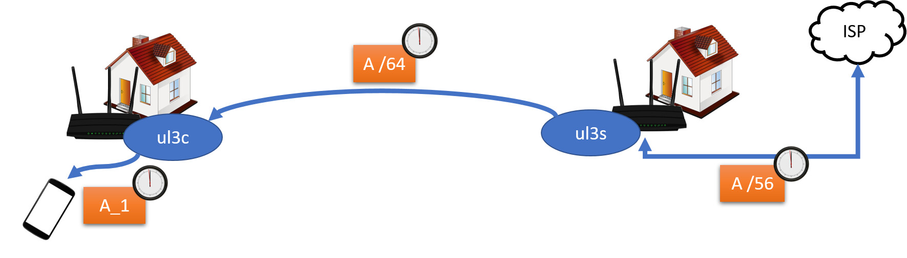
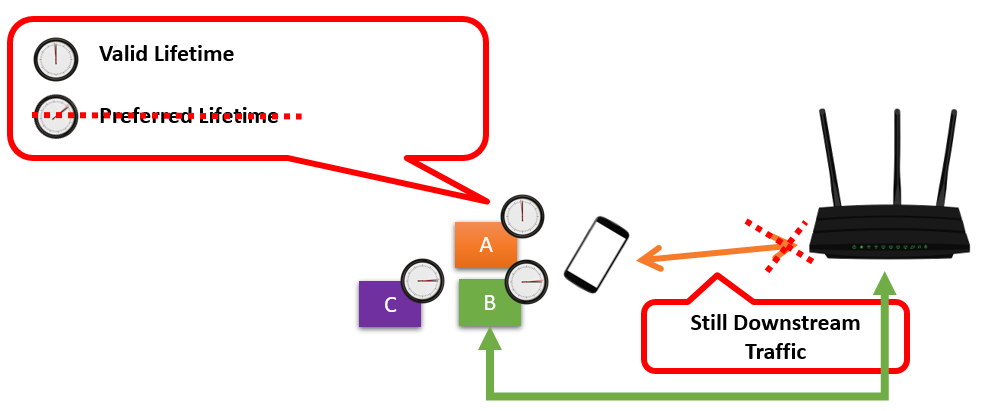

## [WIP] ul3deg

If someone wants to share their DSLer, you need a possible simple prefix assignment in the layer 3 network, which works stateless.

This can happen very easily via an HTTPS REST interface. The gateway is queried for a free prefix, and the gateway returns a prefix. It is very important that the gateway also returns the preferred and valid lifetime it gets from the ISP. We need the time to configure our route advertisement or dhcpv6-server. At the end, we can prevent clients having a downtime, since the prefix becomes outdated.

It also becomes interesting when we work with multiple prefixes with combination from different gateways. We can switch through multiple prefixes and distribute different prefixes to clients. This enables an IPv6 prefix privacy extension across an entire mesh network.

If preferred lifetime is over, only downstream traffic is allowed. In the source-selection the IP address will be avoided.

## Needed
- [odhcpcd PR](https://patchwork.ozlabs.org/project/openwrt/patch/20210130163240.28887-1-vincent@systemli.org/)